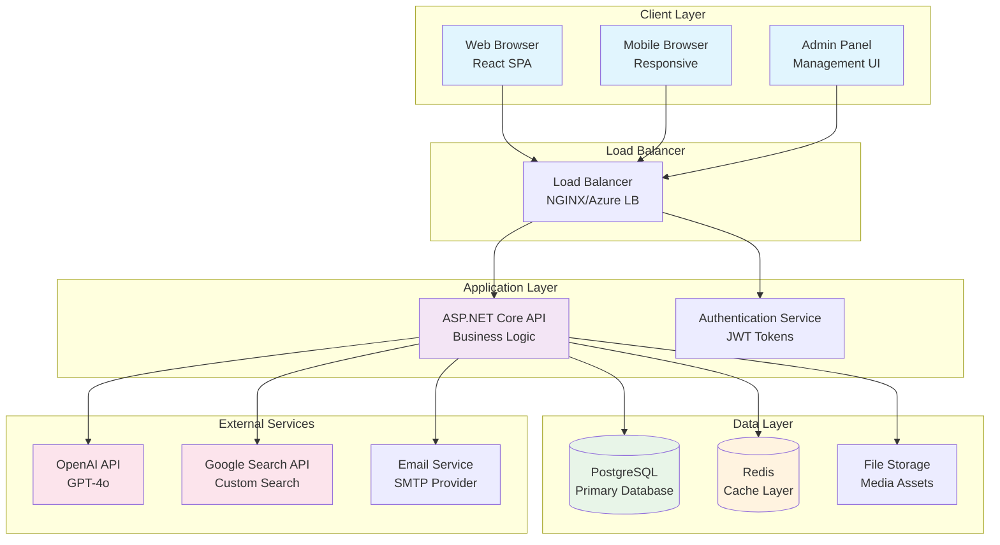
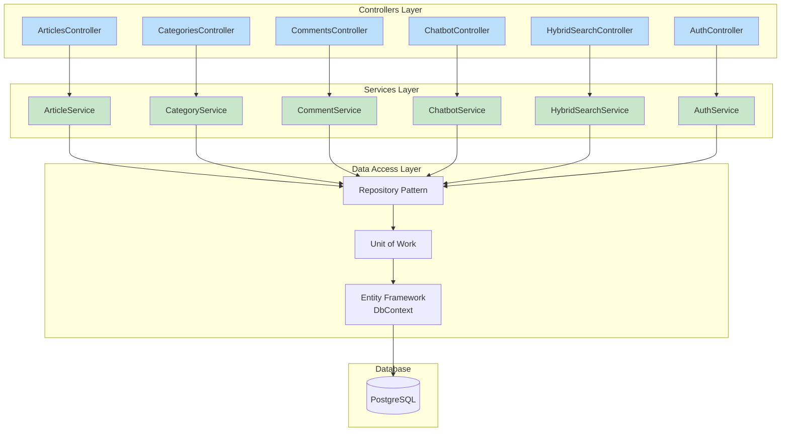
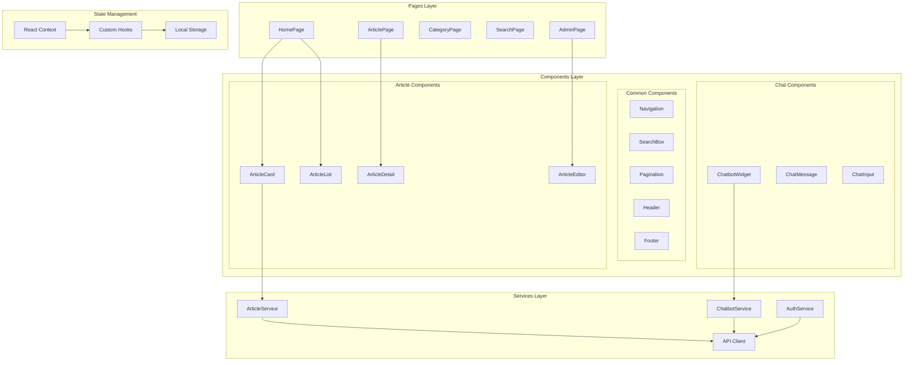
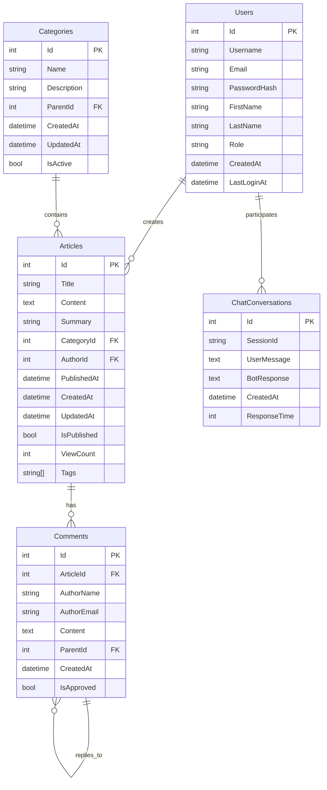
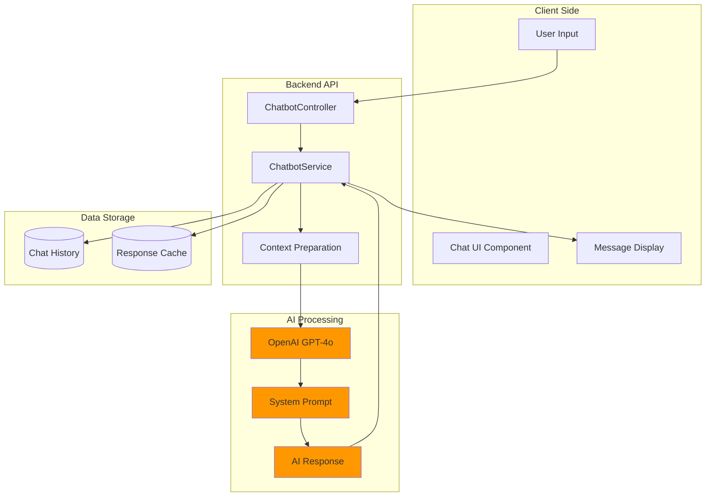
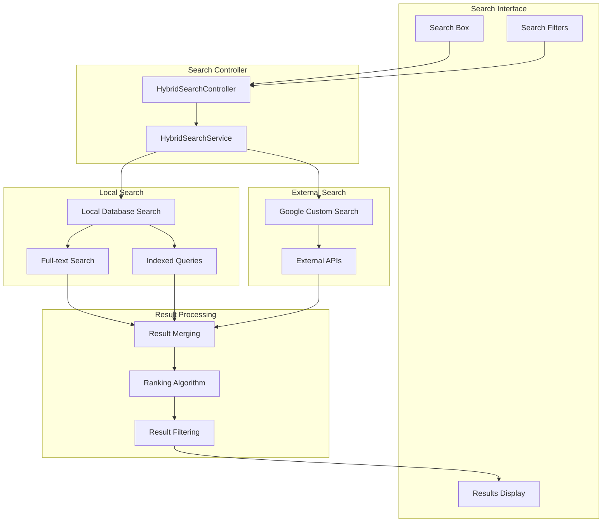
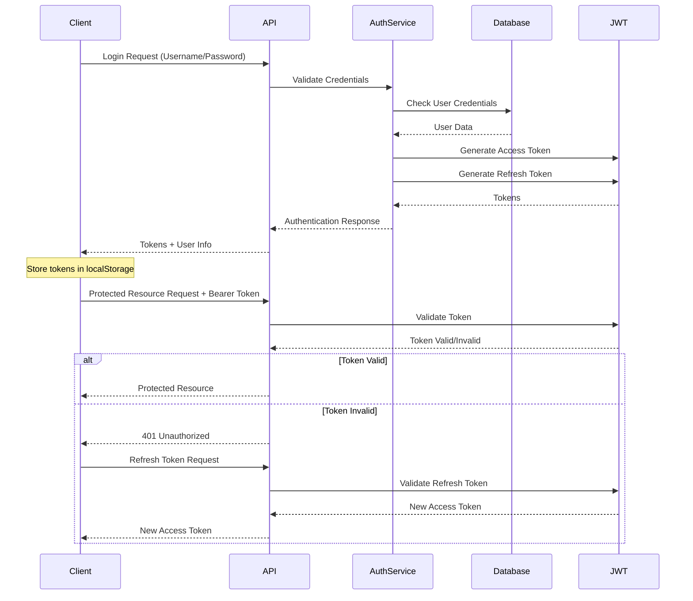
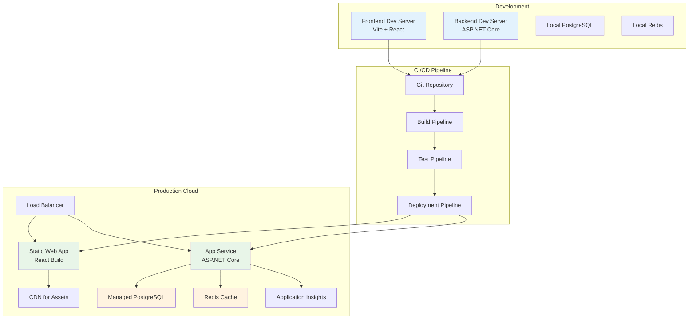

# ДИАГРАМИ НА АРХИТЕКТУРАТА
## СИСТЕМА ЗА УПРАВЛЕНИЕ НА НОВИНИ И ИНТЕЛИГЕНТЕН ЧАТБОТ

### 1. СИСТЕМНА АРХИТЕКТУРА НА ВИСОКО НИВО

### 2. BACKEND API АРХИТЕКТУРА

### 3. FRONTEND КОМПОНЕНТНА АРХИТЕКТУРА

### 4. БАЗА ДАННИ СХЕМА

### 5. AI ЧАТБОТ АРХИТЕКТУРА

### 6. ТЪРСЕНЕ АРХИТЕКТУРА (ХИБРИДНА СИСТЕМА)

### 7. АВТЕНТИФИКАЦИЯ И АВТОРИЗАЦИЯ

### 8. DEPLOYMENT АРХИТЕКТУРА

### ИЗПОЛЗВАНЕ НА ДИАГРАМИТЕ

За да създадете визуални диаграми от този код:

1. **Mermaid Диаграми**: Използвайте [mermaid.live](https://mermaid.live) или [mermaid.js](https://mermaid-js.github.io/mermaid/)
2. **Draw.io**: Импортирайте структурата в [draw.io](https://draw.io)
3. **Lucidchart**: Пресъздайте диаграмите в [lucidchart.com](https://lucidchart.com)
4. **Visio**: Използвайте Microsoft Visio за професионални диаграми

### ОПИСАНИЕ НА ДИАГРАМИТЕ

1. **Системна архитектура** - Общ преглед на цялата система
2. **Backend API** - Детайлна структура на сървърната логика
3. **Frontend компоненти** - Организация на React приложението
4. **База данни** - Релационна схема с всички таблици
5. **AI Чатбот** - Поток от данни за AI функционалността
6. **Търсене** - Хибридна система за локално и външно търсене
7. **Автентификация** - Последователност на JWT валидация
8. **Deployment** - От разработка до продукция

Тези диаграми покриват всички аспекти на архитектурата на вашата система!
