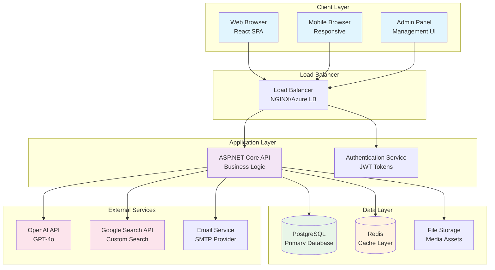

# ДИАГРАМА 1: СИСТЕМНА АРХИТЕКТУРА НА ВИСОКО НИВО

## Копирайте този код в mermaid.live:

```mermaid
graph TB
    subgraph "Client Layer"
        WB[Web Browser<br/>React SPA]
        MB[Mobile Browser<br/>Responsive]
        AP[Admin Panel<br/>Management UI]
    end
    
    subgraph "Load Balancer"
        LB[Load Balancer<br/>NGINX/Azure LB]
    end
    
    subgraph "Application Layer"
        API[ASP.NET Core API<br/>Business Logic]
        AUTH[Authentication Service<br/>JWT Tokens]
    end
    
    subgraph "Data Layer"
        DB[(PostgreSQL<br/>Primary Database)]
        CACHE[(Redis<br/>Cache Layer)]
        FILES[File Storage<br/>Media Assets]
    end
    
    subgraph "External Services"
        OPENAI[OpenAI API<br/>GPT-4o]
        GOOGLE[Google Search API<br/>Custom Search]
        EMAIL[Email Service<br/>SMTP Provider]
    end
    
    WB --> LB
    MB --> LB
    AP --> LB
    LB --> API
    LB --> AUTH
    API --> DB
    API --> CACHE
    API --> FILES
    API --> OPENAI
    API --> GOOGLE
    API --> EMAIL
    
    style WB fill:#e1f5fe
    style MB fill:#e1f5fe
    style AP fill:#e1f5fe
    style API fill:#f3e5f5
    style DB fill:#e8f5e8
    style CACHE fill:#fff3e0
    style OPENAI fill:#fce4ec
    style GOOGLE fill:#fce4ec
```
