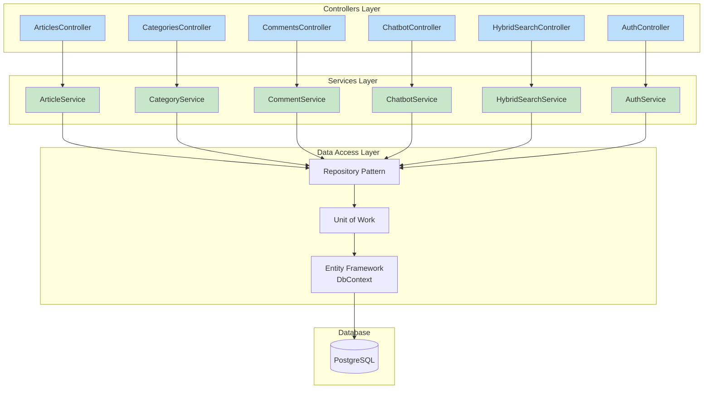

# ДИАГРАМА 2: BACKEND API АРХИТЕКТУРА

## Копирайте този код в mermaid.live:

```mermaid
graph TB
    subgraph "Controllers Layer"
        AC[ArticlesController]
        CC[CategoriesController]
        COM[CommentsController]
        CHAT[ChatbotController]
        SEARCH[HybridSearchController]
        AUTH[AuthController]
    end
    
    subgraph "Services Layer"
        AS[ArticleService]
        CS[CategoryService]
        COMS[CommentService]
        CHATS[ChatbotService]
        SS[HybridSearchService]
        AUTHS[AuthService]
    end
    
    subgraph "Data Access Layer"
        REPO[Repository Pattern]
        UOW[Unit of Work]
        EF[Entity Framework<br/>DbContext]
    end
    
    subgraph "Database"
        DB[(PostgreSQL)]
    end
    
    AC --> AS
    CC --> CS
    COM --> COMS
    CHAT --> CHATS
    SEARCH --> SS
    AUTH --> AUTHS
    
    AS --> REPO
    CS --> REPO
    COMS --> REPO
    CHATS --> REPO
    SS --> REPO
    AUTHS --> REPO
    
    REPO --> UOW
    UOW --> EF
    EF --> DB
    
    style AC fill:#bbdefb
    style CC fill:#bbdefb
    style COM fill:#bbdefb
    style CHAT fill:#bbdefb
    style SEARCH fill:#bbdefb
    style AUTH fill:#bbdefb
    style AS fill:#c8e6c9
    style CS fill:#c8e6c9
    style COMS fill:#c8e6c9
    style CHATS fill:#c8e6c9
    style SS fill:#c8e6c9
    style AUTHS fill:#c8e6c9
```
