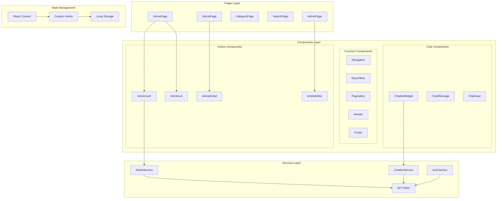

# ДИАГРАМА 3: FRONTEND КОМПОНЕНТНА АРХИТЕКТУРА

## Копирайте този код в mermaid.live:

```mermaid
graph TB
    subgraph "Pages Layer"
        HP[HomePage]
        AP[ArticlePage]
        CP[CategoryPage]
        SP[SearchPage]
        ADMIN[AdminPage]
    end
    
    subgraph "Components Layer"
        subgraph "Article Components"
            AC[ArticleCard]
            AL[ArticleList]
            AD[ArticleDetail]
            AE[ArticleEditor]
        end
        
        subgraph "Common Components"
            NAV[Navigation]
            SEARCH_BOX[SearchBox]
            PAG[Pagination]
            HEADER[Header]
            FOOTER[Footer]
        end
        
        subgraph "Chat Components"
            CHATBOT[ChatbotWidget]
            MSG[ChatMessage]
            INPUT[ChatInput]
        end
    end
    
    subgraph "Services Layer"
        API_CLIENT[API Client]
        ARTICLE_SVC[ArticleService]
        CHAT_SVC[ChatbotService]
        AUTH_SVC[AuthService]
    end
    
    subgraph "State Management"
        CONTEXT[React Context]
        HOOKS[Custom Hooks]
        STORAGE[Local Storage]
    end
    
    HP --> AC
    HP --> AL
    AP --> AD
    ADMIN --> AE
    
    AC --> ARTICLE_SVC
    CHATBOT --> CHAT_SVC
    
    ARTICLE_SVC --> API_CLIENT
    CHAT_SVC --> API_CLIENT
    AUTH_SVC --> API_CLIENT
    
    CONTEXT --> HOOKS
    HOOKS --> STORAGE
```
