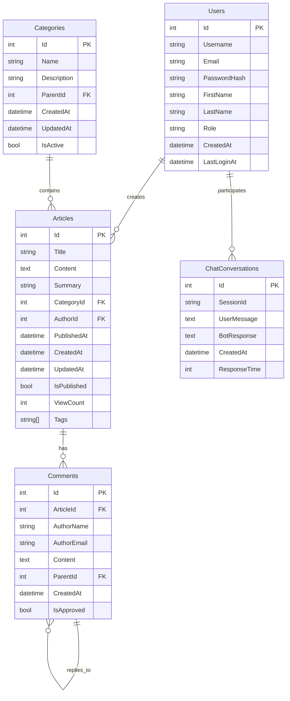

# ДИАГРАМА 4: БАЗА ДАННИ СХЕМА

## Копирайте този код в mermaid.live:

```mermaid
erDiagram
    Users ||--o{ Articles : creates
    Categories ||--o{ Articles : contains
    Articles ||--o{ Comments : has
    Comments ||--o{ Comments : replies_to
    Users ||--o{ ChatConversations : participates
    
    Users {
        int Id PK
        string Username
        string Email
        string PasswordHash
        string FirstName
        string LastName
        string Role
        datetime CreatedAt
        datetime LastLoginAt
    }
    
    Categories {
        int Id PK
        string Name
        string Description
        int ParentId FK
        datetime CreatedAt
        datetime UpdatedAt
        bool IsActive
    }
    
    Articles {
        int Id PK
        string Title
        text Content
        string Summary
        int CategoryId FK
        int AuthorId FK
        datetime PublishedAt
        datetime CreatedAt
        datetime UpdatedAt
        bool IsPublished
        int ViewCount
        string[] Tags
    }
    
    Comments {
        int Id PK
        int ArticleId FK
        string AuthorName
        string AuthorEmail
        text Content
        int ParentId FK
        datetime CreatedAt
        bool IsApproved
    }
    
    ChatConversations {
        int Id PK
        string SessionId
        text UserMessage
        text BotResponse
        datetime CreatedAt
        int ResponseTime
    }
```
