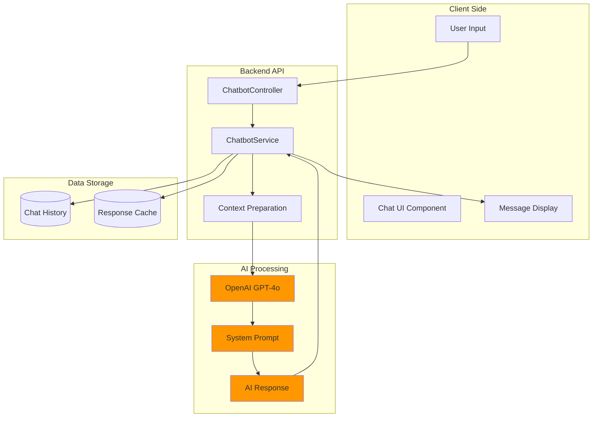

# ДИАГРАМА 5: AI ЧАТБОТ АРХИТЕКТУРА

## Копирайте този код в mermaid.live:

```mermaid
graph TB
    subgraph "Client Side"
        UI[Chat UI Component]
        INPUT[User Input]
        DISPLAY[Message Display]
    end
    
    subgraph "Backend API"
        CONTROLLER[ChatbotController]
        SERVICE[ChatbotService]
        CONTEXT[Context Preparation]
    end
    
    subgraph "AI Processing"
        OPENAI[OpenAI GPT-4o]
        PROMPT[System Prompt]
        RESPONSE[AI Response]
    end
    
    subgraph "Data Storage"
        HISTORY[(Chat History)]
        CACHE[(Response Cache)]
    end
    
    INPUT --> CONTROLLER
    CONTROLLER --> SERVICE
    SERVICE --> CONTEXT
    CONTEXT --> OPENAI
    OPENAI --> PROMPT
    PROMPT --> RESPONSE
    RESPONSE --> SERVICE
    SERVICE --> HISTORY
    SERVICE --> CACHE
    SERVICE --> DISPLAY
    
    style OPENAI fill:#ff9800
    style PROMPT fill:#ff9800
    style RESPONSE fill:#ff9800
```
