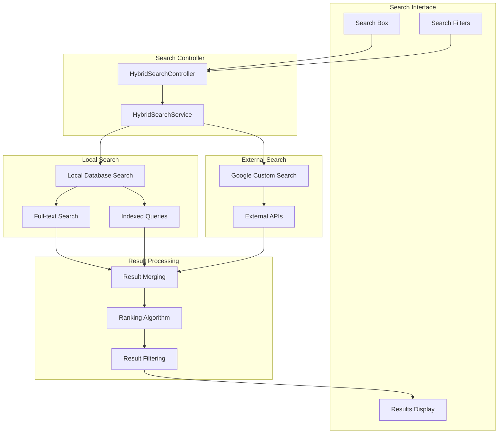

# ДИАГРАМА 6: ТЪРСЕНЕ АРХИТЕКТУРА (ХИБРИДНА СИСТЕМА)

## Копирайте този код в mermaid.live:

```mermaid
graph TB
    subgraph "Search Interface"
        SEARCH_UI[Search Box]
        FILTERS[Search Filters]
        RESULTS[Results Display]
    end
    
    subgraph "Search Controller"
        CONTROLLER[HybridSearchController]
        SERVICE[HybridSearchService]
    end
    
    subgraph "Local Search"
        LOCAL[Local Database Search]
        FULLTEXT[Full-text Search]
        INDEXED[Indexed Queries]
    end
    
    subgraph "External Search"
        GOOGLE[Google Custom Search]
        EXTERNAL[External APIs]
    end
    
    subgraph "Result Processing"
        MERGE[Result Merging]
        RANK[Ranking Algorithm]
        FILTER[Result Filtering]
    end
    
    SEARCH_UI --> CONTROLLER
    FILTERS --> CONTROLLER
    CONTROLLER --> SERVICE
    SERVICE --> LOCAL
    SERVICE --> GOOGLE
    LOCAL --> FULLTEXT
    LOCAL --> INDEXED
    GOOGLE --> EXTERNAL
    FULLTEXT --> MERGE
    INDEXED --> MERGE
    EXTERNAL --> MERGE
    MERGE --> RANK
    RANK --> FILTER
    FILTER --> RESULTS
```
