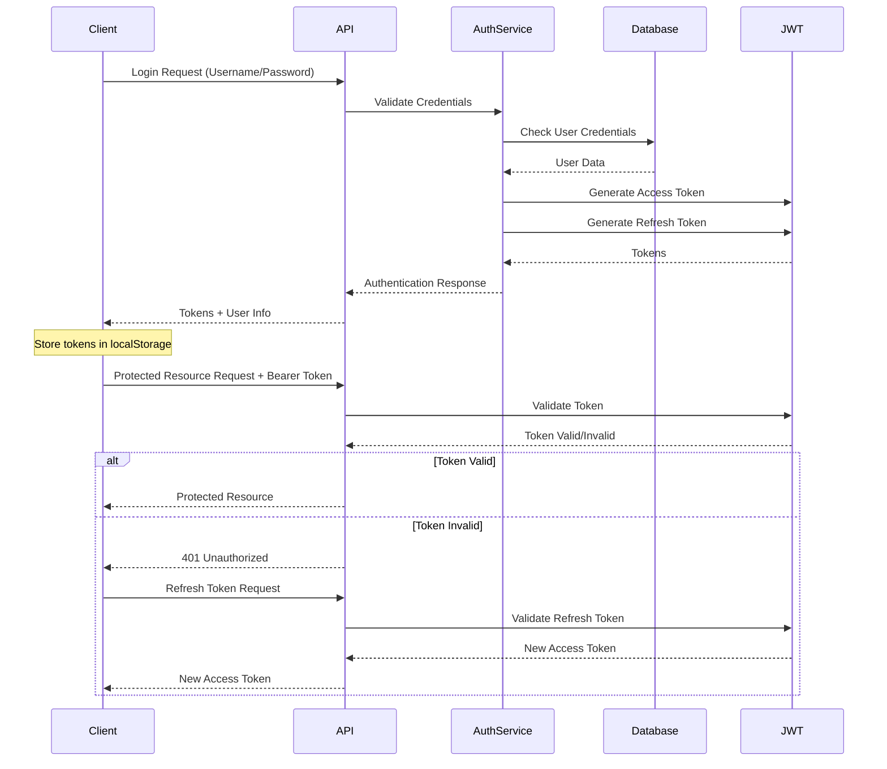

# ДИАГРАМА 7: АВТЕНТИФИКАЦИЯ И АВТОРИЗАЦИЯ

## Копирайте този код в mermaid.live:

```mermaid
sequenceDiagram
    participant Client
    participant API
    participant AuthService
    participant Database
    participant JWT
    
    Client->>API: Login Request (Username/Password)
    API->>AuthService: Validate Credentials
    AuthService->>Database: Check User Credentials
    Database-->>AuthService: User Data
    AuthService->>JWT: Generate Access Token
    AuthService->>JWT: Generate Refresh Token
    JWT-->>AuthService: Tokens
    AuthService-->>API: Authentication Response
    API-->>Client: Tokens + User Info
    
    Note over Client: Store tokens in localStorage
    
    Client->>API: Protected Resource Request + Bearer Token
    API->>JWT: Validate Token
    JWT-->>API: Token Valid/Invalid
    
    alt Token Valid
        API-->>Client: Protected Resource
    else Token Invalid
        API-->>Client: 401 Unauthorized
        Client->>API: Refresh Token Request
        API->>JWT: Validate Refresh Token
        JWT-->>API: New Access Token
        API-->>Client: New Access Token
    end
```
