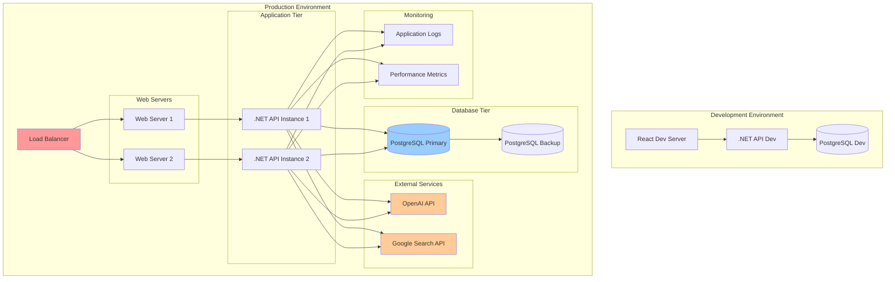

# ДИАГРАМА 8: DEPLOYMENT АРХИТЕКТУРА

## Копирайте този код в mermaid.live:

```mermaid
graph TB
    subgraph "Development Environment"
        DevDB[(PostgreSQL Dev)]
        DevAPI[.NET API Dev]
        DevFE[React Dev Server]
    end
    
    subgraph "Production Environment"
        LB[Load Balancer]
        
        subgraph "Web Servers"
            WS1[Web Server 1]
            WS2[Web Server 2]
        end
        
        subgraph "Application Tier"
            API1[.NET API Instance 1]
            API2[.NET API Instance 2]
        end
        
        subgraph "Database Tier"
            ProdDB[(PostgreSQL Primary)]
            BackupDB[(PostgreSQL Backup)]
        end
        
        subgraph "External Services"
            OpenAI[OpenAI API]
            Google[Google Search API]
        end
        
        subgraph "Monitoring"
            Logs[Application Logs]
            Metrics[Performance Metrics]
        end
    end
    
    DevAPI --> DevDB
    DevFE --> DevAPI
    
    LB --> WS1
    LB --> WS2
    WS1 --> API1
    WS2 --> API2
    
    API1 --> ProdDB
    API2 --> ProdDB
    ProdDB --> BackupDB
    
    API1 --> OpenAI
    API2 --> OpenAI
    API1 --> Google
    API2 --> Google
    
    API1 --> Logs
    API2 --> Logs
    API1 --> Metrics
    API2 --> Metrics
    
    style LB fill:#ff9999
    style ProdDB fill:#99ccff
    style OpenAI fill:#ffcc99
    style Google fill:#ffcc99
```
