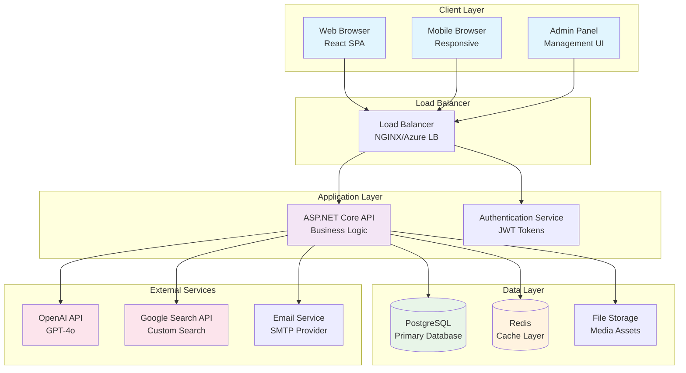
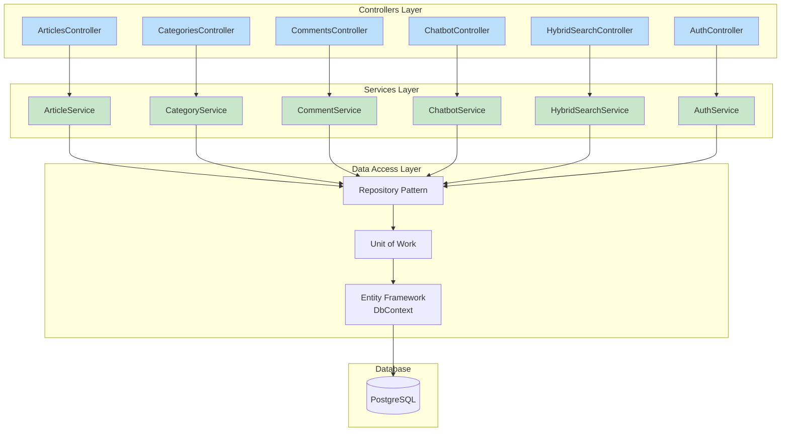
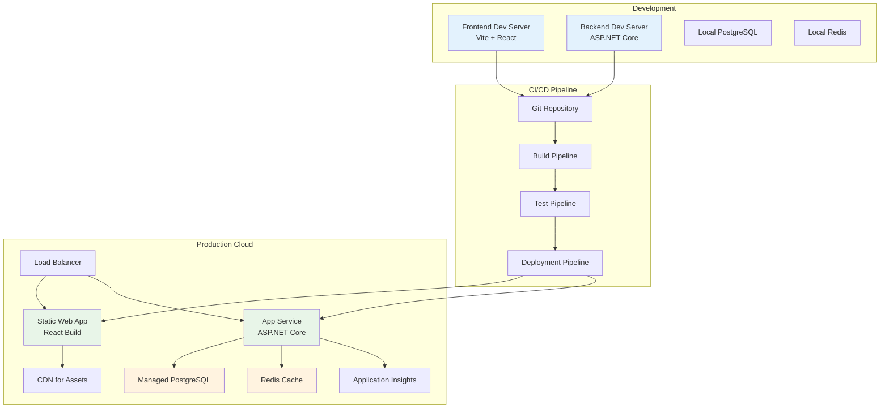

# Visual Representation of Project Architecture

## High-Level System Architecture

## Backend API Architecture

## Deployment Architecture

---

These diagrams represent the high-level system architecture, backend API structure, and deployment pipeline. You can copy the Mermaid code into [mermaid.live](https://mermaid.live) to generate visual diagrams.
