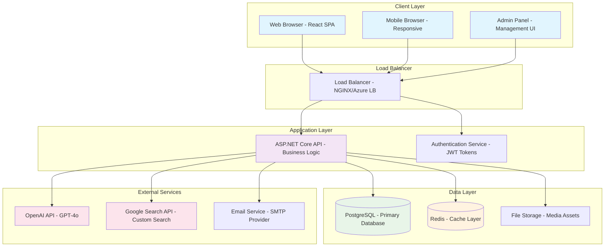

# Simplified and Corrected Visual Representation of Project Architecture

## High-Level System Architecture

---

This simplified Mermaid code ensures compatibility with Mermaid's rendering engine. You can copy this code into [mermaid.live](https://mermaid.live) to generate the diagram. Let me know if you need further assistance!
